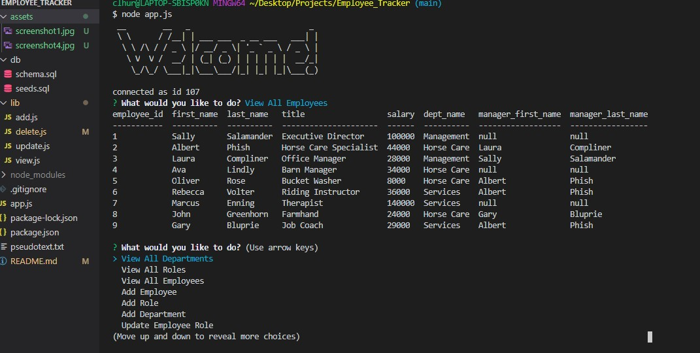
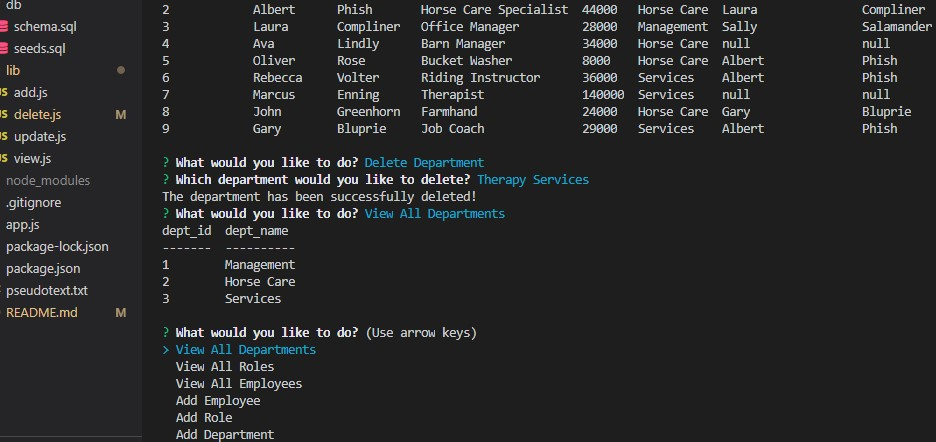
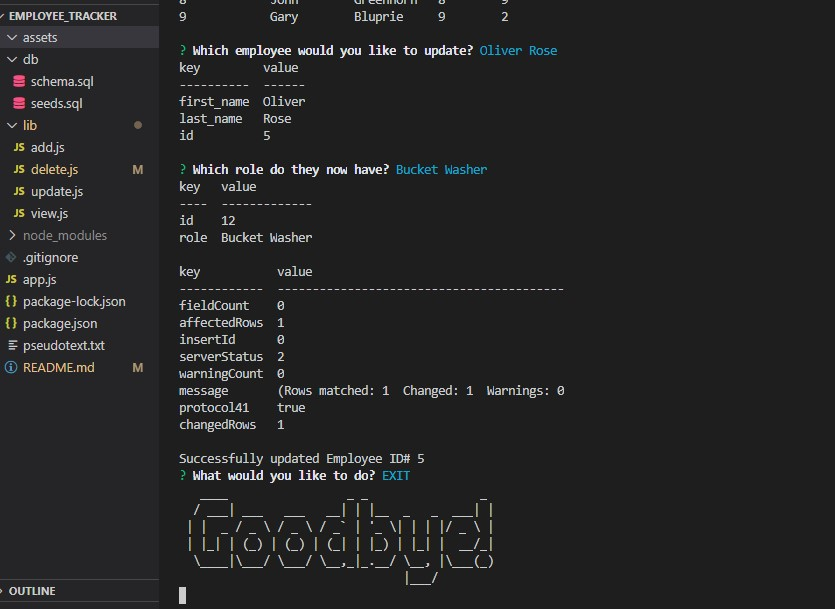

# Employee_Tracker


  ## Description
   A command line application to track employees within an organization using a mySQL database.

   ```
AS A business owner
I WANT to be able to view and manage the departments, roles, and employees in my company
SO THAT I can organize and plan my business
```

  ## 💽 Installation
   Clone the code to your computer and open the root folder in the command line. Run the following to install the node dependencies
   ```
   npm install 
   ```
   After the npm install, you will need to populate the data with the source.sql and seeds.sql files. Once everything is installed and the tables are populated with data the application can be run by the following in the command line
   ```
   node app.js
   ```

  ## ➕ Features
   node inquirer figlet console.table figlet mySQL 

  ## 💾 Screenshots
  
  
   
  
  
 
  

  
 ## 🖥️ Links 
GitHub: https://github.com/clhurlbut/Employee_Tracker <br>
Demo Video: https://drive.google.com/file/d/12FnmpFyxLoKBlwuzwlWwtXbIqFLrXqZf/view <br>

  ## 🧑‍🤝‍🧑 Contributing
   [Contributor Covenant](https://www.contributor-covenant.org/)

  ## 💖 Credits
   Thank you to UCLA / Trilogy Bootcamp!

  ## 📒 License 
   This project is using the MIT License. 

  ## 🙋 Questions 
   Please feel free to contact the developer with any questions/comments/concerns. 
   
   📧 **Email**
   <clhurlbut@gmail.com>
   
   🔗 **GitHub** 
   [clhurlbut](https://github.com/clhurlbut)
   


  This README was generated with 🥔 [readmeGenerator](https://github.com/clhurlbut/readmeGenerator)  
